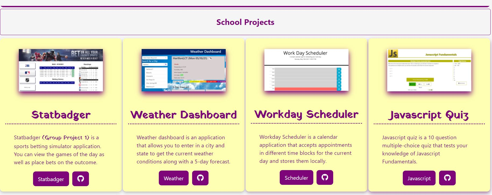

### Malcolm Mason

## About Me 💻

I am an aspiring Web Developer and am also a Database Designer/Developer. I am currently learning [Full Stack Web Development](https://bootcamp.uconn.edu/) at the UCONN School of Engineering in their 6 month Bootcamp program.

## Skills/Languages 🗒️
- HTML/CSS
- Javascript
- JQuery
- Transact-SQL
- Access/Excel VBA
- SSRS

## Projects 🖱️
[Website Portfolio:](https://malmason.github.io/portfolio/) 

## Contact 📱

- [Github](https://github.com/malmason) 
- [LinkedIn](https://www.linkedin.com/in/malcolm-mason-1491a31b9/) 
- [Malcolm](mailto:malmason66@gmail.com) 📧

---
&copy; 2021 Malcolm Mason
<!--
**malmason/malmason** is a ✨ _special_ ✨ repository because its `README.md` (this file) appears on your GitHub profile.

Here are some ideas to get you started:

- 🔭 I’m currently working on ...
- 🌱 I’m currently learning ...
- 👯 I’m looking to collaborate on ...
- 🤔 I’m looking for help with ...
- 💬 Ask me about ...
- 📫 How to reach me: ...
- 😄 Pronouns: ...
- ⚡ Fun fact: ...
-->
